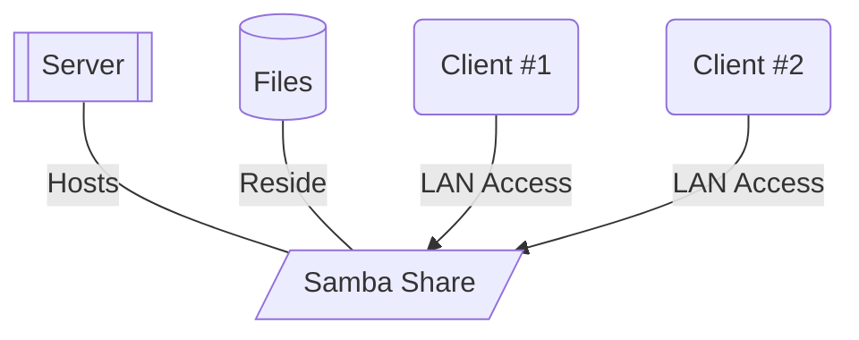
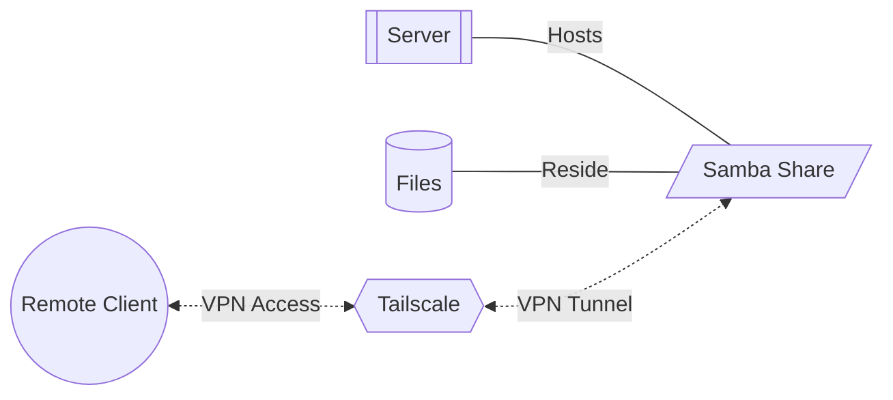
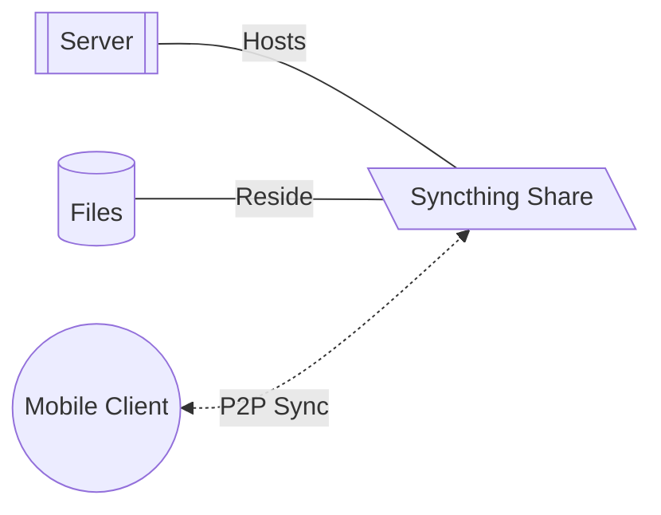
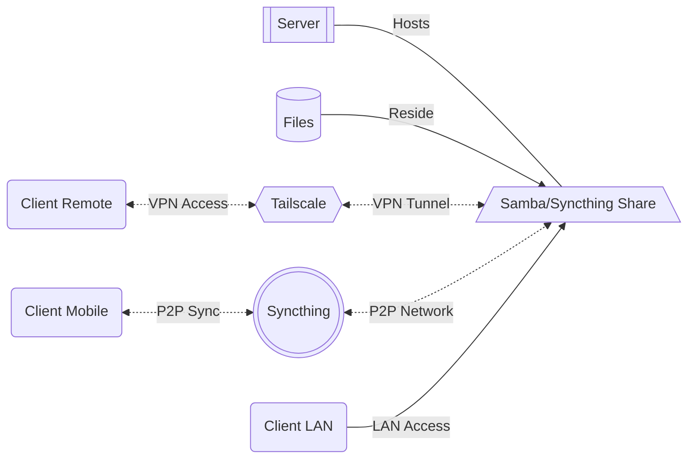
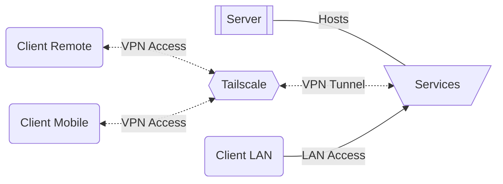



## Homelab considerations for file sharing

I've been thru a couple of homelab revisions, each one making it more usable and friendly than the last, especially when it comes to accessing files. Since I will make another revision soon due to a possible machine migration, I'm gonna share a few words about how I manage to share and access my files remotely, and the motivation behind.

As of now I'm running somewhere around 15 containers, few cronjobs and few services on a HP G4 mini sitting in my living room. Some containers and services serve media files in a web interface, so having access to the files, both in web and inside a file manager, was a big requirement.

Besides that, the trigger for building this was, at one point I reinstalled my OS, and I needed some files which I usually keep inside a flash drive, but I was thinking *it would be nice if I could just have the files **somewhere** so I wouldn't need the flash everytime.*

### First iteration

> Create a [samba](https://www.samba.org/) share.\\
> Mount it as a network drive.\\
> ???\\
> Profit!!!

This was a very first (and rudimentary) solution. It worked wonders, and I could access my files from both my laptops. Only caveat, after I setup my laptop and took it outside, I realized the infra needed an upgrade, as this setup only worked on LAN.

### Tailscale era




> Install [tailscale](https://tailscale.com/).\\
> Register/login/configure.\\
> Access your whole network of devices from anywhere.\\
> ???\\
> Profit!!!

I cannot emphasize enough how much I love [Tailscale](https://tailscale.com/). Since I don't want to open my servers for outside traffic thru a static IP with port forwarding (because haha security amiright, also static IP isn't free), this was the perfect solution. Its based on [wireguard](https://www.wireguard.com/), and if you *really* want to, there's also a self hosted solution, [headscale](https://headscale.net/stable/).

It creates a network mesh of devices, your own personal VPN if you will. Now, things may have changed as I haven't been keeping up to date with wireguard, but at least last time I checked, would I use wireguard, the number of configurations I would have to do would increase exponentially with each new device added on the network. That would happen because each device had to know of all the others, which is simplified with tailscale, once you authenthicate a device on the server, that's it, everything is inter-connected and part of the mesh now.

The free plan is extremely generous, especially for hobbyists, and another really nice feature, when it comes to mobile (android) clients, *you can use the machine's host name to access it*. May not seem like much, but on LAN, unless you mess with the DNS settings, ever since a few years ago, android kind of messed up hostname resolution.

On top of that, the performance is great, I managed to stream movie *backups* from my jellyfin server while being in another continent without any hiccups.

### Syncthing extravaganza




> Install [syncthing](https://syncthing.net/).\\
> Add a folder to it.\\
> Connect clients to it.\\
> Sync.\\
> ???\\
> Profit!!!

This was a game changer for the daily [obsidian](https://obsidian.md/) todo lists among other use cases. While the paid version supports sync between devices, I am using the free one so I had to come up with a solution for my android phone, as network shares are a big hit or miss on android.

I ended up setting up my obsidian library as a syncthing folder on my server, made sure it was in the same location as my LAN samba share, gave access to my phone/tablet to it, and the files synced instantly. The performance is so good, if I have the same note opened on a laptop and on my phone at the same time and I change it on one device, I can see it updating in real time.

There are a lot of options regarding the syncing, and there's also a per folder configuration file to black/white-list files. I've used this more than once when wanting to transfer, for example, pictures or videos from a specific timeframe from my phone to my computer. It works wonders also with big files since it runs at your infra's speeds, capping being based on the devices. I was reaching around 7-900mb/s transfer speeds when syncing large files from my server to my phone over WiFi. The conflict resolution is also pretty good albeit I haven't had many "opportunities" to use it.

### Complete picture





All in all this would be the complete picture with the 3 possible client cases I personally have. To recap, the way I access files and/or services on my server:
  - When at home on LAN: WiFi
  - When away: Tailscale
  - When away on mobile device: Syncthing for files, Tailscale for services
  




As a bonus, this would be the view for services, and as per always, thank you for reading 😎👉

Also wtf I love mermaid diagrams now

